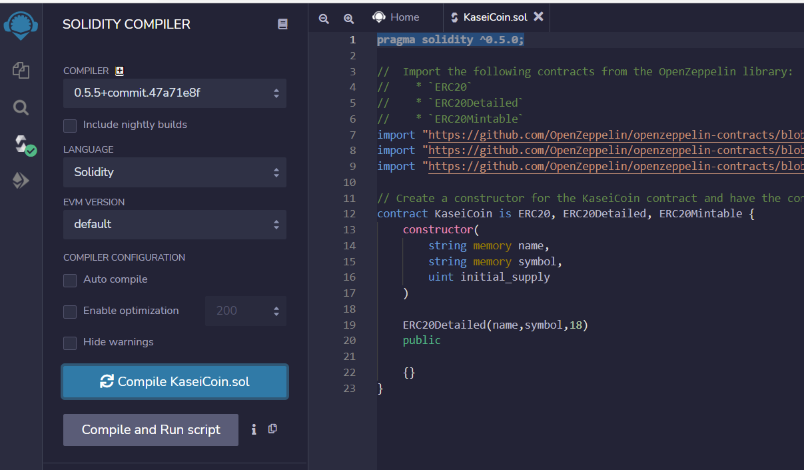
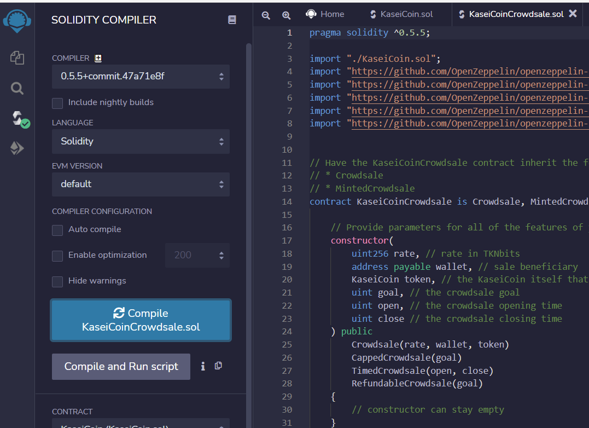
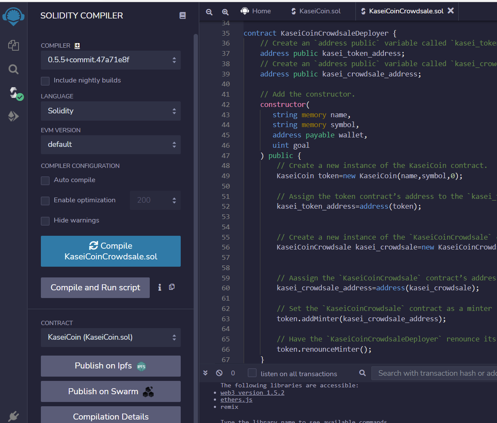

# CryptoCurrency_Crowdsale

This smart contracts define a new cryptocurrency called KaseiCoin and launch a crowdsale that will allow people who are moving to Mars to convert their earthling money to KaseiCoin.

## Technologies

* [Remix IDE](https://remix.ethereum.org/#optimize=false&runs=200&evmVersion=null) - For building and testing smart contracts that you create with Solidity.

* [Ganache](https://trufflesuite.com/ganache/) - For efficient blockchain in UI and CLI testing and introspection of contract data and events.

* [Metamask](https://metamask.io/) - For digital wallet for the Etherium Blockchain

## Usage

To use the smart contract for join saving account management, simply clone all the files from this repository and open **KaseiCoin.sol** and **KaseiCoinCrowdsale.sol**on remix IDE website.

Below are screenshots of smart contract activities.

### Contract compilation screenshots:

### Deploy Remix, Metamask, Ganache

https://user-images.githubusercontent.com/95498383/170838247-0dd7376b-12dd-443b-bf12-92dbe5ce678f.mp4

https://user-images.githubusercontent.com/95498383/170838262-0eba722c-adea-46be-a80a-f2708cafd2f1.mp4

### Buy tokens and check balances

https://user-images.githubusercontent.com/95498383/170838466-2b164fc3-fcaa-407a-abad-9e5bff0094f8.mp4

## Contributors

Brought to you by FinTech Material and Eunice

---

## License

MIT
